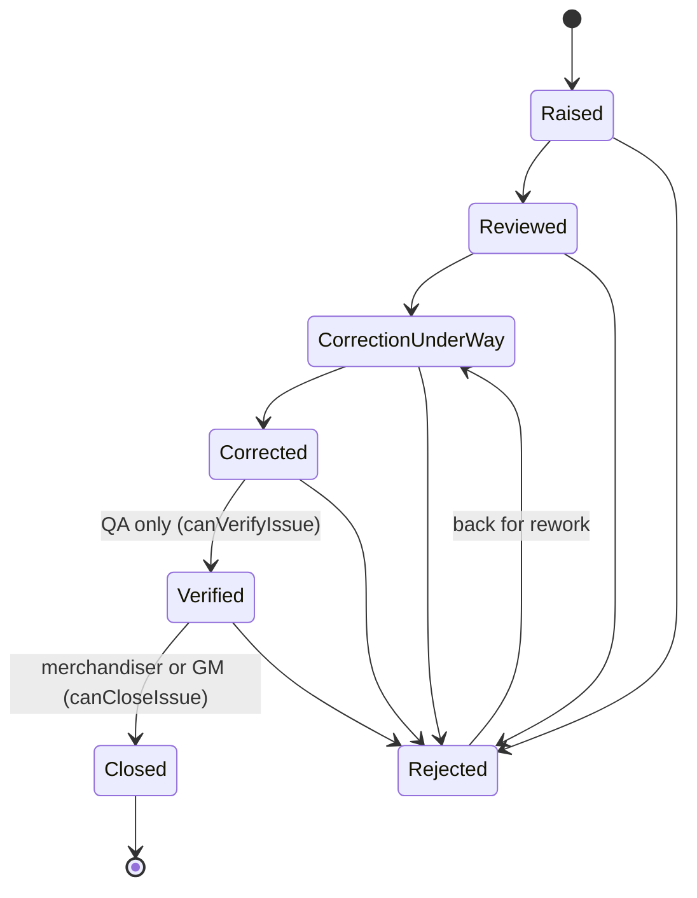

# What you can do with GarmentLine

## What this is

GarmentLine is a sample-approval and production-issue register for a knit-garment
factory in Gazipur, Bangladesh, built end to end on SELISE Blocks Cloud. It holds two
things the factory has to be able to trust: which sample version of a style is the
approved one — stamped with a person and a timestamp, and derived from an append-only
`ApprovalRecord` rather than a mutable status field — and what went wrong on which line,
who owns it, and every step it took from `Raised` to `Closed`, each step written as an
`IssueEvent` the app never edits or deletes. On top of those two registers sit three
things that make them usable on the floor: a repeat-defect rule that raises a persistent
`RepeatAlert` on the second occurrence of the same defect type on the same line inside
ten days; a management view that ranks buyers, lines and defect types over the trailing
thirty days and links every number through to the rows behind it; and an AI step that
turns a messy Banglish buyer comment into an editable action list, where nothing becomes
an issue until a merchandiser presses Accept.

## The five problems it solves

| Problem on the factory floor | How GarmentLine answers it | Where in the app |
|---|---|---|
| Nobody can say for certain which sample version the buyer approved, so bulk risks being cut against the wrong one | "Approved" is derived from the newest `ApprovalRecord` for a version, which carries `ActorId`, `ActorName`, `DecidedAt` and `Note`. The `Status` field on `SampleVersion` is written afterwards and is only a cache for list screens. The style list shows the latest *approved* version, not the latest version | `/samples`, `/samples/:styleId` |
| A defect gets fixed verbally and there is no record of who checked it | Every move writes an `IssueEvent` (actor, kind, message, from-status, to-status, timestamp) *before* the `Issue.Status` row is updated, so a failed status write leaves a visible discrepancy rather than a silent one | `/issues/:id` |
| The same defect recurs on one line and nobody notices until the third time | Every raise — manual or AI-accepted — runs `detectRepeat` over `Issue.RaisedAt` (the floor date, falling back to `CreatedDate`) for the same `Type` and `LineId`. At two occurrences inside ten days a `RepeatAlert` row is written or updated and the factory manager is notified in-app | `/issues/new`, alert table on `/dashboard` |
| The GM has to ring round merchandisers to find out what is costing delivery | One screen tallies the trailing thirty days by buyer, by line and by defect type, names the worst of each, and shows styles and units at risk with a chargeback percentage range read from the `CostAssumption` table | `/dashboard` |
| Buyer comments arrive as mixed Bangla-English prose and get lost or misread | The comment is stored verbatim as a `BuyerComment`, parsed into `ActionItem` rows in state `Proposed`, and shown in a table where every field is editable. Only Accept raises an issue | Buyer-comments panel on `/samples/:styleId` |

## What each role can do

Capability (`src/stores/auth.ts`) answers *what may I do*. Scope
(`src/features/issues/scope.ts`) answers *to which records*. The two are deliberately
separate, which is what lets the factory manager read everything without widening anyone
else. Role slugs come from `ROLES` and are matched against the slugs
`scripts/03-roles-users.mjs` creates.

### superadmin (`superadmin`)

**Sees:** `seesEverything` is false for this slug on its own, so a superadmin who holds
no other role falls through `visibleStyles` / `visibleLines` to the unfiltered list, and
`visibleIssues` returns every issue. In practice: everything.

**Can do:** `canManagePlatform`, `canManagePeople`, `canManageMasterData`,
`canRaiseIssue`, `canEditIssue`, `canAssign`, `canRecordCorrection`, `canVerifyIssue`,
`canCloseIssue`, `canApproveSample`, `canAcceptActionItem`, `canSeeCostImpact`,
`canAcknowledgeAlert`, `canSeeManagementView`, `canShareWithBuyer`, `canSendBuyerMail`.
Counts as `isInternal`.

### admin (`admin`)

**Sees:** everything — `seesEverything` returns true for `admin`, so `visibleStyles`,
`visibleLines` and `visibleIssues` all return the full set unfiltered.

**Can do:** the same full capability list as superadmin: `canManagePlatform`,
`canManagePeople`, `canManageMasterData`, `canRaiseIssue`, `canEditIssue`, `canAssign`,
`canRecordCorrection`, `canVerifyIssue`, `canCloseIssue`, `canApproveSample`,
`canAcceptActionItem`, `canSeeCostImpact`, `canAcknowledgeAlert`,
`canSeeManagementView`, `canShareWithBuyer`, `canSendBuyerMail`. Counts as `isInternal`.

### Factory manager / GM (`factory-manager`)

**Sees:** everything — `seesEverything` returns true, so no style, line or issue is
filtered out.

**Can do:** `canManagePeople`, `canManageMasterData`, `canRaiseIssue`, `canEditIssue`,
`canAssign`, `canRecordCorrection`, `canVerifyIssue`, `canCloseIssue`,
`canApproveSample`, `canAcceptActionItem`, `canSeeCostImpact`, `canAcknowledgeAlert`,
`canSeeManagementView`, `canShareWithBuyer`, `canSendBuyerMail`. Counts as `isInternal`.
**Cannot** `canManagePlatform` — role and permission administration stays with
admin/superadmin.

### Merchandiser (`merchandiser`)

**Sees:** their own work only. `visibleStyles` filters to styles whose `MerchandiserId`
equals the signed-in user's `itemId`; `visibleLines` is not narrowed for this role;
`visibleIssues` returns issues whose `StyleId` is in that style set *or* whose `LineId`
is in the visible line set (an OR, not an AND).

**Can do:** `canManageMasterData`, `canRaiseIssue`, `canEditIssue`, `canAssign`,
`canRecordCorrection`, `canCloseIssue`, `canApproveSample`, `canAcceptActionItem`,
`canSeeManagementView`, `canShareWithBuyer`, `canSendBuyerMail`. Counts as `isInternal`.
**Cannot** `canManagePlatform`, `canManagePeople`, `canVerifyIssue` (verification is
QA's), `canSeeCostImpact` or `canAcknowledgeAlert`. The `/dashboard` route admits the
merchandiser, but the cost-impact card inside it is gated on `canSeeCostImpact` and is
not rendered for them.

### Line supervisor (`line-supervisor`)

**Sees:** their own lines. `visibleLines` filters to lines whose `SupervisorId` equals
the user's `itemId`; `visibleStyles` is not narrowed for this role; `visibleIssues`
returns issues on a visible line or a visible style.

**Can do:** `canRaiseIssue`, `canEditIssue`, `canRecordCorrection`. Counts as
`isInternal`. **Cannot** `canApproveSample` — this is the exclusion the product exists
for, since a supervisor who could stamp a sample could start bulk against a version the
buyer never signed off. Also cannot `canAssign`, `canVerifyIssue`, `canCloseIssue`,
`canAcceptActionItem`, `canSeeManagementView`, `canSeeCostImpact`,
`canAcknowledgeAlert`, `canManageMasterData`, `canManagePeople` or `canManagePlatform`.
A supervisor may open `/samples/:styleId` and read the full decision history; the page
tells them their role can read it but not add to it.

### QA inspector (`qa-inspector`)

**Sees:** everything — `seesEverything` returns true for `qa-inspector`, on the grounds
that QA inspects the whole floor by trade.

**Can do:** `canRaiseIssue`, `canEditIssue`, `canRecordCorrection`, `canVerifyIssue`.
Counts as `isInternal`. **Cannot** `canCloseIssue` (closing is the merchandiser's or
GM's), `canApproveSample`, `canAssign`, `canAcceptActionItem`, `canSeeManagementView`,
`canSeeCostImpact`, `canAcknowledgeAlert`, `canManageMasterData`, `canManagePeople` or
`canManagePlatform`.

### Buyer (`buyer`)

**Sees:** `seesEverything` is false, and the buyer slug matches neither the merchandiser
branch of `visibleStyles` nor the supervisor branch of `visibleLines`, so both fall
through and return the unfiltered lists — and `visibleIssues` therefore returns every
issue. The buyer role is defined in `ROLES` and `ROLE_LABELS` and is described in
`scripts/iam-model.mjs` as external and read-only, but no row-level narrowing for it
exists in `scope.ts` today.

**Can do:** nothing. The buyer holds none of the `can*` capabilities, and `isInternal`
returns false, which hides every sidebar item flagged `internal` — the dashboard, the
three master-data pages and people. A buyer lands on `/issues` after sign-in rather than
`/dashboard`. `scripts/iam-model.mjs` grants the `buyer` role no permissions server-side
either.

## The issue lifecycle

The statuses are exactly the `STATUSES` tuple in `garment-schemas.ts`: `Raised`,
`Reviewed`, `CorrectionUnderWay`, `Corrected`, `Verified`, `Closed`, `Rejected`.
`OPEN_STATUSES` — what the dashboard counts as still costing someone time — is
`Raised`, `Reviewed`, `CorrectionUnderWay`, `Corrected`. `CorrectionUnderWay` is a field
value; screens show the label "Correction under way".

Legal transitions are `NEXT_STATUS`, encoded once so no screen can offer a move the
append-only history would then have to explain:

| From | May become |
|---|---|
| `Raised` | `Reviewed`, `Rejected` |
| `Reviewed` | `CorrectionUnderWay`, `Rejected` |
| `CorrectionUnderWay` | `Corrected`, `Rejected` |
| `Corrected` | `Verified`, `Rejected` |
| `Verified` | `Closed`, `Rejected` |
| `Closed` | — (settled) |
| `Rejected` | `CorrectionUnderWay` |

Who may make a given move is `mayMove` in `src/pages/issue-detail.tsx`, which maps the
*target* status onto a capability:

| Target status | Gate | Roles that hold it |
|---|---|---|
| `Verified` | `canVerifyIssue` | superadmin, admin, factory-manager, qa-inspector |
| `Closed` | `canCloseIssue` | superadmin, admin, factory-manager, merchandiser |
| every other target, including `Rejected` | `canRecordCorrection` | superadmin, admin, factory-manager, merchandiser, line-supervisor, qa-inspector |

The practical consequence: a line supervisor can carry an issue as far as `Corrected`
and no further, because both `Verified` and `Closed` are outside `canRecordCorrection`.
QA can verify but not close. The detail page filters `NEXT_STATUS[issue.Status]` through
`mayMove` and shows only the moves the signed-in role may actually make; when the list
is empty it says either "settled" (no legal next status) or that the role cannot move it.

The reject branch: `Rejected` is reachable from every open status and is written as an
`IssueEvent` of kind `Rejected` rather than `StatusChange`. From `Rejected` the only way
out is back to `CorrectionUnderWay` — a rejected issue is sent back for rework, never
closed from where it stands.

Moving to `Closed` also stamps `ClosedAt` on the issue. Anyone who can open an issue can
add a `Comment` event to its history without changing the status.

## Walkthroughs

### 1. Record a sample decision

Sign in as a merchandiser, factory manager, admin or superadmin. Go to **Samples**
(`/samples`), open a style (`/samples/:styleId`). The header states the approved
version, or "None approved — bulk must not start". Optionally type a note in *Note to
attach to the next decision*, then press **Approve** or **Reject** on a version row.

Expected outcome: a new `ApprovalRecord` is written first with your `ActorId`,
`ActorName`, `DecidedAt` and note; `SampleVersion.Status` is updated afterwards; the
row's *Standing decision* badge changes and the decision joins the *History* column,
which lists every prior decision on that version and removes none. A buyer-decision mail
(`GarmentLineSampleDecision`) and an in-app notification to `factory-manager` and
`merchandiser` fire afterwards; if the mail fails the page says "Decision stamped. Buyer
mail could not be sent — the register stands; resend from Mail."

Sign in as a line supervisor and open the same page: the Approve/Reject column, the note
field and the *Submit a sample version* card are all absent, and the page explains that
the role can read this history but not add to it.

### 2. Raise an issue and carry it to Closed

As a line supervisor, go to **Issues** → **+ Raise an issue** (`/issues/new`). Title,
style and line are required; type, severity, department, due date and owner are set on
the form. Submit.

Expected outcome: an `Issue` is inserted with `Status: "Raised"`, `RaisedBy` and
`RaisedByName` taken from your session, plus an `IssueEvent` of kind `Raised`. You land
on `/issues/:id` unless a repeat alert fired (see walkthrough 3).

On the detail page the supervisor can move `Raised → Reviewed →
CorrectionUnderWay → Corrected`, attaching a note to each move; every move writes an
`IssueEvent` first and then the status. At `Corrected` the supervisor's move selector is
empty and the page says their role cannot move it further. Sign in as QA to move
`Corrected → Verified`; sign in as the merchandiser or GM to move `Verified → Closed`,
which stamps `ClosedAt`. The full timeline — actor, time, kind, message, from → to — is
on the same page, oldest first.

### 3. Trigger the repeat-defect warning

Raise a second issue of the *same* `Type` on the *same* line as an existing issue whose
`CreatedDate` is inside the last ten days (`REPEAT_WINDOW_DAYS = 10`,
`REPEAT_ALERT_AT = 2`). Use `/issues/new`.

Expected outcome: the page does **not** navigate away. It shows a warning banner reading
"<Type> defects now N× on this line inside 10 days — a 3rd occurrence means the pattern
is systemic, not chance. The factory manager has been notified." with a link to the
dashboard. Behind it, a `RepeatAlert` row is inserted with the line, defect type, window
in days, occurrence count and the linked issue ids (last ten); if an unacknowledged alert
for that line and type already exists it is updated in place instead, and no second
notification is sent. On first detection only, an in-app notification goes to the
`factory-manager` role. The alert survives the page: it is a row, not a toast.

### 4. Parse a Banglish buyer comment and accept one action

As a merchandiser (or GM/admin/superadmin — the panel is gated on
`canAcceptActionItem`), open `/samples/:styleId` and scroll to **Buyer comments → action
list**. Pick a channel (Email, WhatsApp, TechPack) and a sample version (or leave
"Latest"), paste the comment — for example `body length thik ache but CB length 1cm kom
lagche, placket ektu wide, collar tipping e shading` — and press **Record & propose
actions**.

Expected outcome: the raw text is stored as a `BuyerComment`, then parsed. The proposal
engine is the Blocks AI agent (`/agents-api/ai-agent/query/stream`, SSE, session-token
auth); if it is unreachable the built-in Banglish lexicon parses instead and the panel
shows an amber **Fallback parser** badge with the reason, rather than a green **Blocks AI
agent** badge. `BuyerComment.ParsedAt` and `ParsedBy` record which engine ran. Each
proposal is stored as an `ActionItem` in state `Proposed`, and the review table lets you
edit What, Part, Department, Urgency and Type on any row.

Edit one row, press **Accept** on it: that row alone is raised through `useRaiseIssue` —
the same path as a manual raise, so the repeat-defect rule applies — the `ActionItem` is
updated to state `Accepted` with your edits, `AcceptedBy`, `AcceptedAt` and the new
`IssueId`, and the cell becomes a link to the issue. Press **Reject** on another row:
state becomes `Rejected` and no issue is created. Rows you never decide stay `Proposed`
and are never official. The *Recorded comments* table below shows "N/M accepted" per
comment and which engine parsed it.

### 5. Read the GM management view

Sign in as the factory manager and open **Dashboard** (`/dashboard`; the route admits
superadmin, admin, factory-manager and merchandiser).

Expected outcome: four figures — open issues (statuses in `OPEN_STATUSES`), worst buyer,
worst line and worst defect type, each over the trailing thirty days from
`Issue.CreatedDate`, with the count behind it as a hint. Below, three ranked lists
(by line, by buyer, by type, top six each) for the same window. If any unacknowledged
`RepeatAlert` exists, a repeat-defect table appears above them with line, defect, occurrence
count, window, detection date and a link per issue id in the trail, plus the alert's
stored message. Last, gated on `canSeeCostImpact` so the merchandiser does not see it:
styles at risk, units at risk summed from `Style.OrderQty`, and a chargeback exposure
shown as a `min–max` percentage range read from the `CostAssumption` keys
`ChargebackMinPct` and `ChargebackMaxPct`, with `AirFreightPerKg`, `SeaFreightPerKg` and
`ReworkPiecesPerHour` in the note beneath. The range is deliberate — a single number
would be invented precision. All figures are computed over `visibleIssues`, so a
merchandiser sees the same shape of view narrowed to their own scope.

### 6. Manage master data

As a merchandiser, GM, admin or superadmin, use the **Configuration** group in the
sidebar: **Buyers** (`/buyers`), **Styles** (`/styles`), **Lines** (`/lines`). All three
run the same register component: search, add form, inline edit, bulk activate/deactivate
via the Status column, and delete behind a confirmation.

Expected outcome: rows are created and edited directly. Buyer `Name`, Style `StyleCode`
and Line `Name` are unique and required; `StyleCode` is locked once the row exists, so an
issue raised against ST-2451 cannot be silently reattached to a different code. Styles
pick their buyer from a reference dropdown built from the buyer table. These tables are
editable on purpose — master data describes the organisation and changes with it; the
registers of record live elsewhere and are not edited here.

**People** (`/people`) is a separate route restricted to superadmin, admin and
factory-manager — deliberately not the merchandiser, so authority over the product and
authority over access stay apart. It lists IAM users with name, email, role badges and
active state, and is read-only.

## What is guaranteed

| Property | How it holds |
|---|---|
| **Approval of record** | The approved version of a style is derived by reading the newest `ApprovalRecord` for each version, not by trusting a flag. `decide()` writes the record first and `SampleVersion.Status` second; if the second write fails, the decision still stands in the trail. No code path updates or deletes an `ApprovalRecord`. |
| **Append-only issue history** | Every lifecycle move and every comment inserts an `IssueEvent` carrying actor id, actor name, kind, message, from-status, to-status and time. The event is written *before* the `Issue.Status` update, so a partial failure leaves a visible, correctable trail entry rather than a silent status change. No code path updates or deletes an `IssueEvent`. |
| **Actor names are captured, not joined** | `displayName` is resolved at write time into `ActorName` / `RaisedByName`. A person can be renamed or lose their roles later; the trail still shows who acted, under the name they acted under. |
| **AI proposes, never records** | `parse-comment.ts` performs no gateway writes at all — it is a proposal engine and says so. Proposals are stored as `ActionItem` rows in state `Proposed`, every field editable. Only a human pressing Accept creates an `Issue`, and it goes through the same `useRaiseIssue` path as a manual raise. The engine that produced a list is always labelled, so a fallback is never passed off as the agent's work. |
| **Permission-gated decisions** | The approve control, the buyer-comment panel, the raise form, the transition selector, the cost-impact card, the master-data routes and the people route are each gated on a named `can*` function or a `RequireRole` route guard. The exclusion that matters most is explicit: `canApproveSample` omits `line-supervisor`. |
| **The repeat rule cannot be bypassed** | Both roads to a new issue — the manual form and AI acceptance — call `useRaiseIssue`, and the window check runs inside it over the raised set including the new row. |
| **Notices never gate records** | Mail and Notifier calls resolve with `{ ok: false }` instead of throwing, and are fired with `Promise.allSettled` after the record is written. A dead SMTP server cannot unwind a stamped decision. |

## Blocks services used

| Service | What it does here |
|---|---|
| **Data Gateway** | The eleven schemas defined by `scripts/01-define-schemas.mjs`: `Buyer`, `Style`, `Line`, `SampleVersion`, `ApprovalRecord`, `Issue`, `IssueEvent`, `BuyerComment`, `ActionItem`, `RepeatAlert`, `CostAssumption`. Typed CRUD hooks are generated per schema in `garment-schemas.ts`; operation names are read back from `/data/v4/schemas` rather than guessed, because the platform pluralises by appending "s" regardless of English. |
| **IAM** | Roles and `garmentline::*` permissions created by `scripts/03-roles-users.mjs` from `scripts/iam-model.mjs` (sixteen permissions across platform, issue lifecycle, samples, action list and management), the demo users, and `/iam/v4/iam/me` for session bootstrap. `/iam/v4/iam/users` backs the read-only People page. |
| **IDP / OIDC** | Browser sign-in via `/iam/v4/idp/initiate` → hosted login → `/login/callback` → `/iam/v4/idp/callback`, handling both the access-token body and the HttpOnly-cookie deployment; refresh through `/iam/v4/oidc/token`. |
| **Logic · Mail** | `POST /logic/v4/Mail/SendToAny` with purpose `GarmentLineSampleDecision`, sent after an approval record stands. Template saved by `scripts/05-mail-template.mjs`. |
| **Logic · Notifier** | `POST /logic/v4/Notifier/Notify` to role slugs — `factory-manager` and `merchandiser` on a sample decision, `factory-manager` when a repeat pattern is first detected. |
| **AI Agents** | `POST /agents-api/ai-agent/query/stream` with the session token, answered over SSE (`chat_response` / `chat_error`). The model is addressed directly via `model_name` and `model_provider` from env, so no portal agent has to exist. A deterministic Banglish lexicon is the labelled fallback. |
| **Localization / LMT** | `POST /localization/v4/Key/Gets` overlays the bundled EN + বাংলা dictionary, fetched once per load so the login screen is already translated and the service strings replace the bundled ones when they arrive. |

## Limits and what is next

Stated plainly, because a demo that overclaims is worse than one that is narrow.

- **Row-level scope is UI-side only.** `scope.ts` says so in its own header: the filters
  are the visible half. Row-level enforcement belongs in a Data Gateway access policy
  comparing the owner field to the token subject, and until that exists a determined
  signed-in user could query another scope's rows directly. The capability functions in
  `auth.ts` carry the same caveat — IAM holds the permission model server-side, but the
  `can*` helpers gate the UI, not the API.
- **Append-only is a convention, not yet a gateway policy.** `scripts/schemas.mjs`
  describes `ApprovalRecord` and `IssueEvent` as APPEND-ONLY, and no code path in the app
  updates or deletes either — but `01-define-schemas.mjs` defines fields and reloads the
  configuration; it does not deploy data-access rules that would refuse an update or a
  delete at the gateway.
- **Evidence upload is not implemented.** `SampleVersion.EvidenceFileIds` and
  `IssueEvent.EvidenceFileIds` exist as fields and are threaded through `issueEvent()`,
  but nothing in the app calls Blocks Storage: every write passes an empty array, and
  there is no upload control on the issue detail page or the sample page.
- **Repeat alerts cannot be acknowledged from the UI.** `canAcknowledgeAlert` and the
  `garmentline::alert::acknowledge` permission are defined and granted to
  superadmin/admin/factory-manager, and the dashboard filters to `Acknowledged === false`
  — but no screen writes `Acknowledged`. In practice an alert stays live until a raise
  for the same line and type updates it.
- **The repeat check is client-side.** `raise.ts` explains why: Logic database triggers
  are on the roadmap, not shipped, so the rule lives in the one code path every raise goes
  through. A record inserted by any other means would not be checked.
- **People management is read-only.** `users.tsx` lists IAM users and nothing more.
  Inviting a user creates an inactive account needing an emailed activation link, so that
  work stays with the provisioning scripts rather than behind a button that looks instant.
- **Several capabilities are defined but not yet wired to a control.**
  `canManagePlatform`, `canAssign`, `canEditIssue`, `canShareWithBuyer` and
  `canSendBuyerMail` are exported from `auth.ts` but no component currently calls them;
  the buyer mail is sent unconditionally as part of the approval flow rather than behind
  `canSendBuyerMail`.
- **The AI-accepted issue picks a line arbitrarily.** When a merchandiser accepts a
  proposed action, `buyer-comments.tsx` assigns the first active line in the list rather
  than asking which line the work belongs to — which also means the repeat-defect window
  is evaluated against that line.
- **The buyer role has no row-level narrowing.** It holds no capabilities and sees no
  internal navigation, but `scope.ts` has no branch for it, so its list reads are not
  filtered to the buyer's own styles.
